 

I'm currently a senior at Harvey Mudd College finishing up my double major in CS and Studio Art.

# Projects

Here is short list of some coding projects I've been involved in. You can go to each project's repository for more details 

## [Hyperschedule](https://github.com/muddCreates/hyperschedule) v2

- Hyperschedule is the course scheduler used by the majority of the students at the Claremont Colleges.
- I lead an effort to rewrite the code from scratch using TypeScript, React, NodeJS, and MongoDB. 

## [Cross Context Events](https://github.com/mia1024/cross-context-events) 
- A lightweight library written in Typescript for event synchronization and messaging across Javascript execution contexts. 

## [Discord Mosaic Bot](https://github.com/mia1024/discord-mosaic-bot)
- A Discord chatbot written in Python that sends out solid-color emojis as pixels for pixel arts. Work in progress. 

## [Terminal Minesweeper](https://github.com/mia1024/terminal-minesweeper) 
- An implementation of the classic Minesweeper in terminal using the curses library in Python. Can be played with either keyboard, mouse, or both on compatible terminals. Listed on PyPi as `terminal-minesweeper`.

## [Space Invaders](https://github.com/mia1024/space-invaders)
- A Rust implementation of the classic arcade game space invaders in terminal

## [Pride Nyancat](https://github.com/mia1024/pride-nyancat)
- A fork of the [terminal nyancat](https://github.com/klange/nyancat) but changed the background to various pride-flags. Color-corrected other parts of the image. Also added support for Truecolor terminals.

